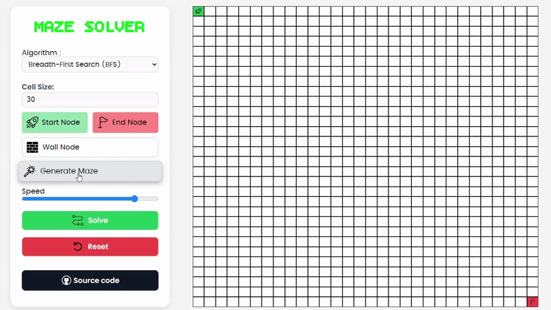
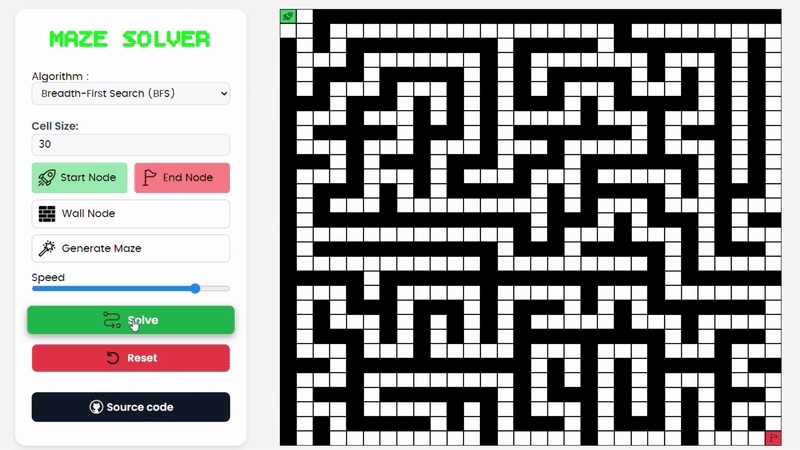

# Maze Solver

An interactive web-based maze solver and pathfinding visualization tool.

Visualize BFS, DFS, Dijkstra, and A* in real time — with smooth animations, adjustable speed, and full control over maze creation.

🔗 Live Demo: [@Link](https://omda777.github.io/Maze-Solver/)
## Demo
### Maze Generation
### Use Recursive backtracking with Randomized directions

### Pathfinding Visualization


## Features

- **4 Pathfinding Algorithms**: BFS, DFS, Dijkstra's, and A*
- **Interactive Maze Creation**: Manual wall placement with drag support
- **Automatic Maze Generation**: Recursive backtracking algorithm
- **Real-time Visualization**: Step-by-step algorithm visualization with adjustable speed
- **Customizable Grid**: Adjustable size from 5x5 to 30x30

## Getting Started

1. Clone the repository:
```bash
git clone https://github.com/omda777/Maze-Solver.git
```

2. Open `index.html` in your web browser or use a local server:
```bash
python -m http.server 8000
```

3. Visit `http://localhost:8000` in your browser
---

## Algorithms

- **BFS**: Guarantees shortest path in unweighted graphs
- **DFS**: Explores deeply before backtracking
- **Dijkstra's**: Finds shortest path in weighted graphs
- **A***: Heuristic-based optimal pathfinding

